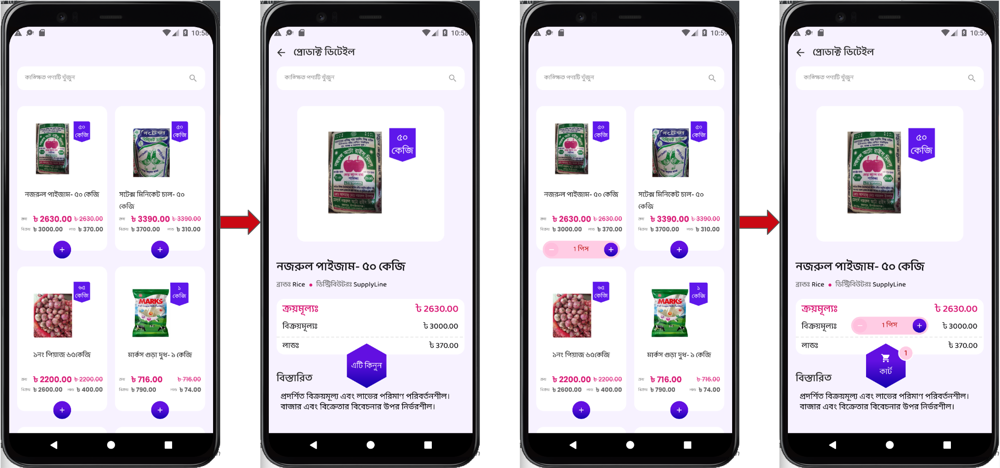

# Flutter Task

A Flutter E-Commerce app with lots of components like routing, navigation, cards, form elements, etc. Check out demo




## What's inside

- Routing
- State Managemet using [get](https://pub.dev/packages/get)
- Cards, List Items
- Horizontal Card Slider
- Snackbar to show masseges


## Getting Started

#### 1. Clone and Install

```bash
# Clone the repo
git clone https://github.com/NafisaHenaBushra/Flutter_Task.git

# Navigate to clonned folder and Install dependencies
cd flutter_eCommerce_ui_kit && flutter packages get
```

## Contributing

If you find any problems, please [open an issue](https://github.com/NafisaHenaBushra/Flutter_Task/issues/new) or submit a fix as a pull request.
